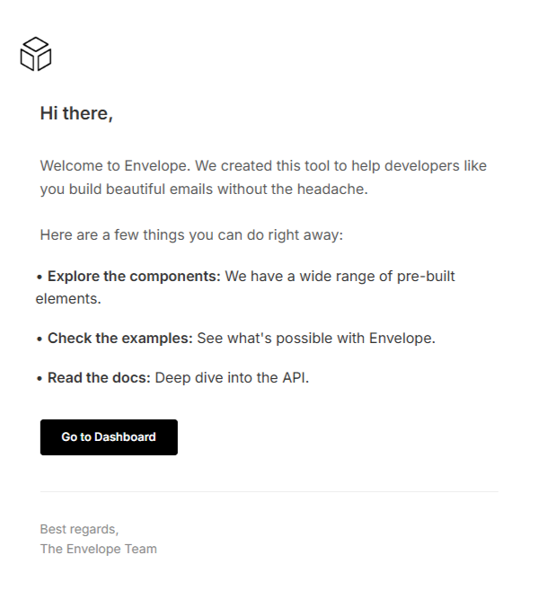
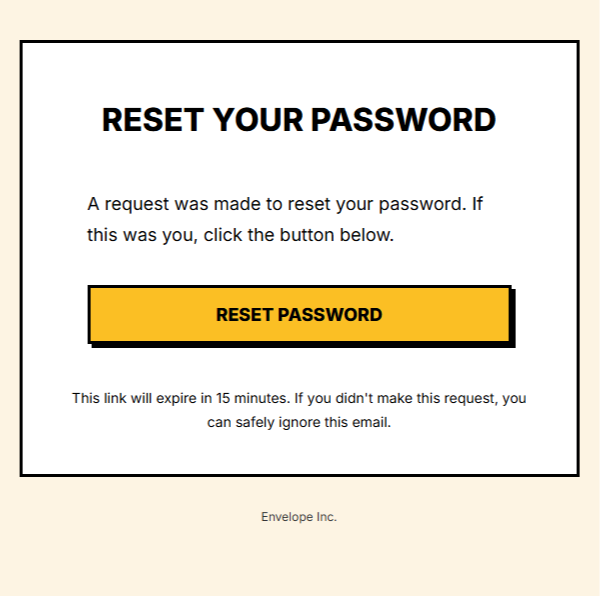
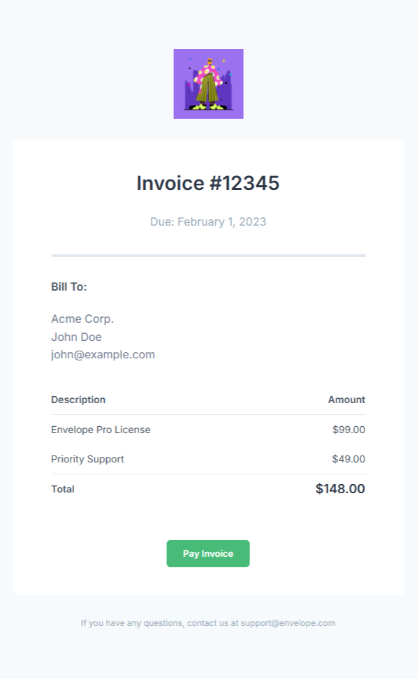
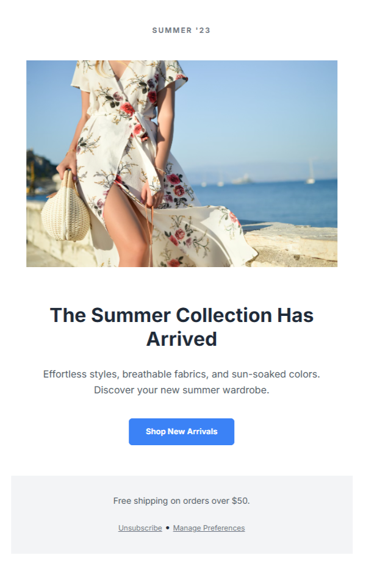
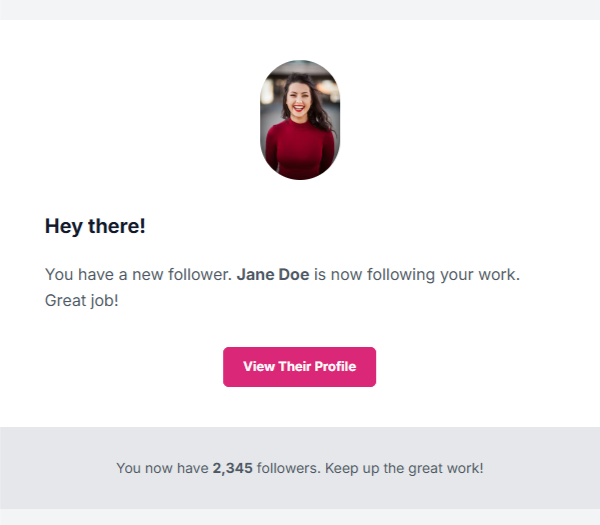

<div>
    
</div>

# Envelope

[](https://github.com/konanyhin/envelope/blob/master/LICENSE)
[](https://packagist.org/packages/konanyhin/envelope)
[](https://packagist.org/packages/konanyhin/envelope)

Envelope is a PHP library for building MJML emails with a clean, object-oriented approach.

## Requirements

- **PHP** ≥ 8.3
- **mjml** package

## 📦 Installation

First, install the package via Composer:

```bash
composer require konanyhin/envelope
```

This library also requires the official MJML JavaScript engine to render the final HTML. Make sure you have **Node.js 16 or higher** installed, then install
`mjml` in your project:

```bash
# With npm
npm install mjml

# Or with Yarn
yarn add mjml
```

## ✨ Key features

* **Fluent & Clean**: Chain methods to build your email structure naturally.
* **Component Helpers**: Quickly create any MJML component with static helpers.
* **Dynamic Slots**: Create templates with placeholders and fill them with content later.
* **Built-in Validation**: Catches errors like invalid attributes or misplaced elements.

## 🚀 Quick Start

```php
use Konanyhin\Envelope\Envelope;
use Konanyhin\Envelope\Helpers\Body;
use Konanyhin\Envelope\Helpers\Head;

$envelope = Envelope::new();

// Add elements to the <mj-head>
$envelope->head(
    Head::title('My Awesome Email'),
    Head::preview('Sneak peek of the content...')
);

// Add elements to the <mj-body>
$envelope->body(
    Body::section()->add(
        Body::column()->add(
            Body::text('Left Column', ['color' => '#333333'])
        ),
        Body::column()->add(
            Body::text('Right Column', ['color' => '#555555'])
        ),
    ),
    Body::section()->add(
        Body::column()->add(
            Body::button('Click Me', ['href' => 'https://example.com'])
        )
    )            
);

// Get the final HTML
echo $envelope->toHtml();
```

## 🧩 The Slot System

Slots are placeholders you can put anywhere in your layout. This is perfect for creating a master template and filling it with different content later.

### 1. Define a Layout with Slots

You can configure your base template, for example, in your Dependency Injection container. You can define multiple slots for different dynamic sections.

```php
use Konanyhin\Envelope\Envelope;
use Konanyhin\Envelope\Helpers\Body;

// Example container definition
return [
    Envelope::class => function () {
        $envelope = Envelope::new();

        // Define the general layout structure
        $envelope->body(
            Body::section()->add(
                Body::column()->add(
                    Body::text('Your website name'),
                    Body::slot('main_action'), // A slot for a required action
                    Body::slot('optional_footer') // A slot for optional content
                )
            )
        );

        return $envelope;
    },
];
```

### 2. Fill the Slots

Inject the `Envelope` into your service. Any slot you don't replace
will simply render as an empty string.

```php
use Konanyhin\Envelope\Envelope;
use Konanyhin\Envelope\Helpers\Body;
use Konanyhin\Envelope\Helpers\Head;

class EmailService
{
    public function __construct(
        private Envelope $envelope
    ) {}

    public function getWelcomeEmail(): string
    {
        // Set email-specific head elements
        $this->envelope->head(
            Head::title('Welcome!')
        );

        // Create the dynamic content for this specific email
        $button = Body::button('Confirm Your Account', [
            'href' => 'https://example.com/confirm',
            'background-color' => '#28a745'
        ]);

        // Find the slot and replace it with the button
        $this->envelope->replace('main_action', $button);

        // The 'optional_footer' slot was not replaced, so it will not appear in the final HTML.

        // Return the final HTML
        return $this->envelope->toHtml();
    }
}
```

The `replace()` method is smart and will throw an exception if you try to replace a slot that doesn't exist, helping you catch errors early.

## 🖼️ Examples

### 1️⃣ Welcome email

<details>
<summary>Show code</summary>

```php
use Konanyhin\Envelope\Envelope;
use Konanyhin\Envelope\Helpers\Body;
use Konanyhin\Envelope\Helpers\Head;

$envelope = Envelope::new()
    ->addCssVariables([
        'white' => '#ffffff',
        'muted-color' => '#555555',
        'font-weight-bold' => '600',
    ])->head(
        Head::title('Welcome to Envelope'),
        Head::preview('Let\'s get you started.'),
        Head::font(['name' => 'Inter', 'href' => 'https://fonts.googleapis.com/css2?family=Inter:wght@400;600&display=swap']),
        Head::attributes()
            ->add('mj-all', ['font-family' => 'Inter, sans-serif', 'color' => '#333333'])
            ->add('mj-text', ['font-size' => '16px', 'line-height' => '1.6'])
            ->add('mj-section', ['background-color' => '{{--white}}'])
    )->body(
        Body::wrapper(['background-color' => '{{--white}}', 'padding' => '20px'])->add(
            // Header with Logo
            Body::section(['padding-bottom' => '20px', 'text-align' => 'left'])->add(
                Body::column()->add(
                    Body::image([
                        'width' => '40px',
                        'src' => 'https://images.unsplash.com/vector-1739887191008-d6df8d48b1a9?q=80&w=880&auto=format&fit=crop&ixlib=rb-4.1.0&ixid=M3wxMjA3fDB8MHxwaG90by1wYWdlfHx8fGVufDB8fHx8fA%3D%3D',
                        'alt' => 'Envelope Logo',
                        'align' => 'left',
                        'padding' => '0'
                    ])
                )
            ),
            // Main Content - "The Letter" style
            Body::section(['padding' => '0'])->add(
                Body::column()->add(
                    Body::text('Hi there,', [
                        'font-size' => '20px',
                        'font-weight' => '{{--font-weight-bold}}',
                        'padding-bottom' => '20px'
                    ]),
                    Body::text('Welcome to Envelope. We created this tool to help developers like you build beautiful emails without the headache.', [
                        'padding-bottom' => '16px',
                        'color' => '{{--muted-color}}'
                    ]),
                    Body::text('Here are a few things you can do right away:', [
                        'padding-bottom' => '10px',
                        'color' => '{{--muted-color}}'
                    ]),
                    // List items simulated with text
                    Body::text('• <strong>Explore the components:</strong> We have a wide range of pre-built elements.', ['padding-bottom' => '8px', 'padding-left' => '20px']),
                    Body::text('• <strong>Check the examples:</strong> See what\'s possible with Envelope.', ['padding-bottom' => '8px', 'padding-left' => '20px']),
                    Body::text('• <strong>Read the docs:</strong> Deep dive into the API.', ['padding-bottom' => '24px', 'padding-left' => '20px']),

                    Body::button('Go to Dashboard', [
                        'href' => 'https://example.com/',
                        'background-color' => '#000000',
                        'color' => '{{--white}}',
                        'border-radius' => '4px',
                        'font-weight' => '{{--font-weight-bold}}',
                        'inner-padding' => '12px 24px',
                        'align' => 'left',
                        'padding-bottom' => '30px'
                    ]),

                    Body::divider(['border-color' => '#eeeeee', 'border-width' => '1px']),

                    Body::text('Best regards,<br>The Envelope Team', [
                        'padding-top' => '20px',
                        'font-size' => '14px',
                        'color' => '#888888'
                    ])
                )
            )
        )
    );

echo $envelope->toHtml();
```

</details>

<details open>
<summary>Render</summary>

<div>
    
</div>

</details>

### 2️⃣ Password reset email

<details>
<summary>Show code</summary>

```php
use Konanyhin\Envelope\Envelope;
use Konanyhin\Envelope\Helpers\Body;
use Konanyhin\Envelope\Helpers\Head;

$envelope = Envelope::new()
    ->addCssVariables([
        'bg-color' => '#FDF4E3',
        'card-bg-color' => '#FFFFFF',
        'primary-color' => '#000000',
        'accent-color' => '#FBBF24',
        'font-weight-black' => '800',
    ])->head(
        Head::title('Password Reset'),
        Head::preview('A password reset was requested for your account.'),
        Head::font(['name' => 'Inter', 'href' => 'https://fonts.googleapis.com/css2?family=Inter:wght@400;800&display=swap']),
        Head::style(
            // The box-shadow will be applied in clients that support it (like Apple Mail, Gmail).
            // It will be ignored in others (like Outlook) but the button will still look great.
            '.neubrutal-button table { box-shadow: 4px 4px 0 #000000; }'
        ),
        Head::attributes()
            ->add('mj-all', ['font-family' => 'Inter, sans-serif'])
            ->add('mj-text', ['font-size' => '18px', 'line-height' => '1.7', 'color' => '{{--primary-color}}'])
            ->add('mj-section', ['padding' => '0'])
            ->add('mj-button', ['border-radius' => '0', 'font-weight' => '{{--font-weight-black}}'])
    )->body(
        Body::wrapper(['background-color' => '{{--bg-color}}', 'padding' => '40px 20px'])->add(
        // Main Card
            Body::section([
                'background-color' => '{{--card-bg-color}}',
                'border' => '3px solid {{--primary-color}}',
                'border-radius' => '0',
                'padding' => '40px',
            ])->add(
                Body::column()->add(
                    Body::text('RESET YOUR PASSWORD', [
                        'align' => 'center',
                        'font-size' => '32px',
                        'font-weight' => '{{--font-weight-black}}',
                        'padding-bottom' => '32px',
                    ]),
                    Body::text('A request was made to reset your password. If this was you, click the button below.', [
                        'padding-bottom' => '24px',
                    ]),
                    Body::button('RESET PASSWORD', [
                        'href' => 'https://example.com/',
                        'css-class' => 'neubrutal-button',
                        'background-color' => '{{--accent-color}}',
                        'color' => '{{--primary-color}}',
                        'border' => '3px solid {{--primary-color}}',
                        'width' => '100%',
                        'font-size' => '18px',
                        'inner-padding' => '16px 0',
                    ]),
                    Body::text("This link will expire in 15 minutes. If you didn't make this request, you can safely ignore this email.", [
                        'font-size' => '14px',
                        'align' => 'center',
                        'padding' => '32px 0 0 0',
                    ])
                )
            ),
            // Footer
            Body::section(['padding' => '20px'])->add(
                Body::column()->add(
                    Body::text('Envelope Inc.', [
                        'align' => 'center',
                        'font-size' => '12px',
                        'color' => '#333',
                    ])
                )
            )
        )
    );

echo $envelope->toHtml();
```

</details>

<details open>
<summary>Render</summary>

<div>
    
</div>

</details>

### 3️⃣ Invoice

<details>
<summary>Show code</summary>

```php
use Konanyhin\Envelope\Envelope;
use Konanyhin\Envelope\Helpers\Body;
use Konanyhin\Envelope\Helpers\Head;

$envelope = Envelope::new()
    ->addCssVariables([
        'text-color' => '#4a5568',
        'white' => '#ffffff',
        'heading-color' => '#2d3748',
        'muted-color' => '#a0aec0',
        'border-color' => '#e2e8f0',
        'font-weight-bold' => '600',
    ])->head(
        Head::title('Invoice #12345'),
        Head::preview('Your invoice from Envelope'),
        Head::font(['name' => 'Inter', 'href' => 'https://fonts.googleapis.com/css2?family=Inter:wght@400;600&display=swap']),
        Head::attributes()
            ->add('mj-all', ['font-family' => 'Inter, sans-serif', 'color' => '{{--text-color}}'])
            ->add('mj-text', ['font-size' => '16px', 'line-height' => '1.6'])
            ->add('mj-section', ['background-color' => '{{--white}}'])
            ->add('mj-table', ['color' => '{{--text-color}}', 'font-size' => '14px'])
    )->body(
        Body::wrapper(['background-color' => '#f7fafc', 'padding' => '40px 20px'])->add(
            // Header
            Body::section(['background-color' => 'transparent', 'padding-bottom' => '20px'])->add(
                Body::column()->add(
                    Body::image([
                        'width' => '100px',
                        'src' => 'https://plus.unsplash.com/premium_vector-1706545055123-ed5955825000?q=80&w=880&auto=format&fit=crop&ixlib=rb-4.1.0&ixid=M3wxMjA3fDB8MHxwaG90by1wYWdlfHx8fGVufDB8fHx8fA%3D%3D',
                        'align' => 'center'
                    ])
                )
            ),
            // Card
            Body::section(['border-radius' => '8px', 'padding' => '30px'])->add(
                Body::column()->add(
                    Body::text('Invoice #12345', [
                        'align' => 'center',
                        'font-size' => '28px',
                        'font-weight' => '{{--font-weight-bold}}',
                        'color' => '{{--heading-color}}'
                    ]),
                    Body::text('Due: February 1, 2023', [
                        'align' => 'center',
                        'color' => '{{--muted-color}}',
                        'padding-bottom' => '24px'
                    ]),
                    Body::divider(['border-color' => '{{--border-color}}']),
                    Body::text('Bill To:', [
                        'font-weight' => '{{--font-weight-bold}}',
                        'padding-top' => '20px'
                    ]),
                    Body::text('Acme Corp.<br/>John Doe<br/>john@example.com', [
                        'color' => '#718096',
                        'padding-bottom' => '20px'
                    ]),
                    Body::table(
                        '<tr style="border-bottom:1px solid {{--border-color}}; text-align:left;">
                        <th style="padding: 10px 0; font-weight: {{--font-weight-bold}};">Description</th>
                        <th style="padding: 10px 0; font-weight: {{--font-weight-bold}}; text-align: right;">Amount</th>
                    </tr>
                    <tr>
                        <td style="padding: 10px 0;">Envelope Pro License</td>
                        <td style="padding: 10px 0; text-align: right;">$99.00</td>
                    </tr>
                    <tr>
                        <td style="padding: 10px 0; border-bottom:1px solid {{--border-color}};">Priority Support</td>
                        <td style="padding: 10px 0; text-align: right; border-bottom:1px solid {{--border-color}};">$49.00</td>
                    </tr>
                    <tr>
                        <td style="padding: 10px 0; font-weight: {{--font-weight-bold}};">Total</td>
                        <td style="padding: 10px 0; text-align: right; font-weight: {{--font-weight-bold}}; font-size: 18px; color: {{--heading-color}};">$148.00</td>
                    </tr>'
                    ),
                    Body::spacer(['height' => '32px']),
                    Body::button('Pay Invoice', [
                        'href' => 'https://example.com/',
                        'background-color' => '#48bb78',
                        'color' => '{{--white}}',
                        'border-radius' => '6px',
                        'font-weight' => '{{--font-weight-bold}}',
                        'inner-padding' => '12px 24px',
                        'align' => 'center'
                    ])
                )
            ),
            // Footer
            Body::section(['background-color' => 'transparent', 'padding-top' => '20px'])->add(
                Body::column()->add(
                    Body::text('If you have any questions, contact us at support@envelope.com', [
                        'align' => 'center',
                        'font-size' => '12px',
                        'color' => '{{--muted-color}}'
                    ])
                )
            )
        )
    );

echo $envelope->toHtml();
```

</details>

<details open>
<summary>Render</summary>

<div>
    
</div>

</details>

### 4️⃣ Newsletter email

<details>
<summary>Show code</summary>

```php
use Konanyhin\Envelope\Envelope;
use Konanyhin\Envelope\Helpers\Body;
use Konanyhin\Envelope\Helpers\Head;

$envelope = Envelope::new()
    ->addCssVariables([
        'white' => '#ffffff',
        'muted-color' => '#4b5563',
        'light-muted-color' => '#6b7280',
        'font-weight-bold' => '700',
        'align-center' => 'center',
    ])->head(
        Head::title('The Summer Collection is Here'),
        Head::preview('Fresh looks for the new season.'),
        Head::font(['name' => 'Inter', 'href' => 'https://fonts.googleapis.com/css2?family=Inter:wght@400;700&display=swap']),
        Head::attributes()
            ->add('mj-all', ['font-family' => 'Inter, sans-serif', 'color' => '#1f2937'])
            ->add('mj-text', ['font-size' => '16px', 'line-height' => '1.6'])
            ->add('mj-section', ['background-color' => '{{--white}}', 'padding' => '0'])
    )->body(
        Body::wrapper(['padding' => '20px'])->add(
            // Header
            Body::section(['padding' => '10px 0 20px 0'])->add(
                Body::column()->add(
                    Body::text('SUMMER \'23', [
                        'align' => '{{--align-center}}',
                        'font-size' => '12px',
                        'font-weight' => '{{--font-weight-bold}}',
                        'letter-spacing' => '2px',
                        'color' => '{{--light-muted-color}}'
                    ])
                )
            ),
            // Hero Image
            Body::section()->add(
                Body::column()->add(
                    Body::image([
                        'src' => 'https://images.unsplash.com/photo-1496747611176-843222e1e57c?q=80&w=1173&auto=format&fit=crop&ixlib=rb-4.1.0&ixid=M3wxMjA3fDB8MHxwaG90by1wYWdlfHx8fGVufDB8fHx8fA%3D%3D',
                        'alt' => 'Summer Collection',
                        'fluid-on-mobile' => 'true'
                    ])
                )
            ),
            // Content
            Body::section(['padding' => '40px 20px'])->add(
                Body::column()->add(
                    Body::text('The Summer Collection Has Arrived', [
                        'align' => '{{--align-center}}',
                        'font-size' => '32px',
                        'font-weight' => '{{--font-weight-bold}}',
                        'line-height' => '1.2',
                        'padding-bottom' => '16px'
                    ]),
                    Body::text('Effortless styles, breathable fabrics, and sun-soaked colors. Discover your new summer wardrobe.', [
                        'align' => '{{--align-center}}',
                        'color' => '{{--muted-color}}',
                        'padding-bottom' => '24px'
                    ]),
                    Body::button('Shop New Arrivals', [
                        'href' => 'https://example.com/',
                        'background-color' => '#3b82f6',
                        'color' => '{{--white}}',
                        'border-radius' => '6px',
                        'font-weight' => '{{--font-weight-bold}}',
                        'inner-padding' => '14px 28px',
                        'align' => '{{--align-center}}'
                    ])
                )
            ),
            // Footer
            Body::section(['padding' => '20px', 'background-color' => '#f3f4f6'])->add(
                Body::column()->add(
                    Body::text('Free shipping on orders over $50.', [
                        'align' => '{{--align-center}}',
                        'font-size' => '14px',
                        'color' => '{{--muted-color}}'
                    ]),
                    Body::text('<a href="#" style="color: {{--light-muted-color}}; font-size: 12px;">Unsubscribe</a> &bull; <a href="#" style="color: {{--light-muted-color}}; font-size: 12px;">Manage Preferences</a>', [
                        'align' => '{{--align-center}}',
                        'padding-top' => '10px'
                    ])
                )
            )
        )
    );

echo $envelope->toHtml();
```

</details>

<details open>
<summary>Render</summary>

<div>
    
</div>

</details>

### 5️⃣ New follower email

<details>
<summary>Show code</summary>

```php
use Konanyhin\Envelope\Envelope;
use Konanyhin\Envelope\Helpers\Body;
use Konanyhin\Envelope\Helpers\Head;

$envelope = Envelope::new()
    ->addCssVariables([
        'white' => '#ffffff',
        'muted-color' => '#4b5563',
        'font-weight-bold' => '700',
    ])->head(
        Head::title('You have a new follower!'),
        Head::preview('Jane Doe is now following you.'),
        Head::font(['name' => 'Inter', 'href' => 'https://fonts.googleapis.com/css2?family=Inter:wght@400;700&display=swap']),
        Head::attributes()
            ->add('mj-all', ['font-family' => 'Inter, sans-serif', 'color' => '#111827'])
            ->add('mj-text', ['font-size' => '16px', 'line-height' => '1.6'])
            ->add('mj-section', ['background-color' => '{{--white}}'])
    )->body(
        Body::wrapper(['background-color' => '#f3f4f6'])->add(
            // Main content section
            Body::section(['padding' => '30px 20px'])->add(
                Body::column()->add(
                    Body::image([
                        'width' => '80px',
                        'src' => 'https://images.unsplash.com/photo-1494790108377-be9c29b29330?auto=format&fit=crop&w=160&q=80',
                        'alt' => 'User Avatar',
                        'border-radius' => '40px',
                        'padding-bottom' => '20px'
                    ]),
                    Body::text('Hey there!', [
                        'font-size' => '20px',
                        'font-weight' => '{{--font-weight-bold}}',
                        'padding-bottom' => '10px'
                    ]),
                    Body::text('You have a new follower. <strong>Jane Doe</strong> is now following your work. Great job!', [
                        'color' => '{{--muted-color}}',
                        'padding-bottom' => '24px'
                    ]),
                    Body::button('View Their Profile', [
                        'href' => 'https://example.com/',
                        'background-color' => '#db2777',
                        'color' => '{{--white}}',
                        'border-radius' => '6px',
                        'font-weight' => '{{--font-weight-bold}}',
                        'inner-padding' => '12px 20px'
                    ])
                )
            ),
            // Footer
            Body::section(['background-color' => '#e5e7eb', 'padding' => '20px'])->add(
                Body::column()->add(
                    Body::text('You now have <strong>2,345</strong> followers. Keep up the great work!', [
                        'align' => 'center',
                        'font-size' => '14px',
                        'color' => '{{--muted-color}}'
                    ])
                )
            )
        )
    );

echo $envelope->toHtml();
```

</details>

<details open>
<summary>Render</summary>

<div>
    
</div>

</details>

## ⚠️ Known Issues

* **Duplicate Slot Names**: The library does not currently prevent the creation of multiple slots with the same name. If you define duplicate slot names,
  `replace()` will only replace the *first* one it finds. It is the user's responsibility to ensure all slot names are unique within an envelope.
* `mj-include`: This package does not support the `mj-include` tag.

## ✅ Testing

This project uses Pest for testing. To run the full test suite:

```bash
composer test
```

## 📄 License

This project is licensed under the [MIT License](LICENSE.md).
